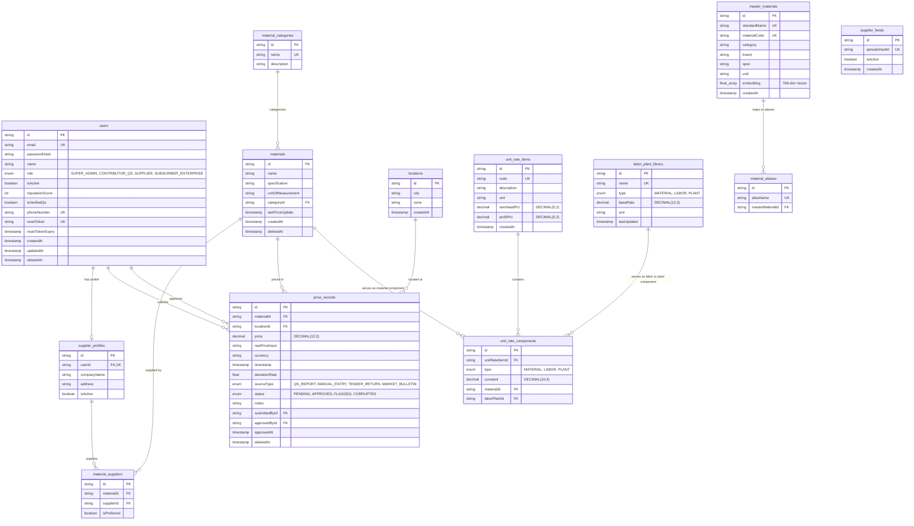
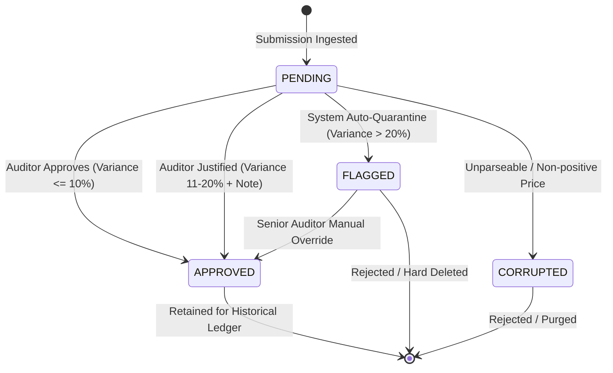

  # National Construction Cost Database (NCCDB)
## Technical Architecture & Data Platform Specification

---

### Executive Summary

The **National Construction Cost Database (NCCDB)** is an enterprise-grade digital market intelligence and cost benchmarking platform engineered for the construction and civil engineering industry. It ingests, standardizes, validates, and models construction material prices, labor wage rates, equipment plant costs, and composite unit rate assemblies across geopolitical zones and primary industrial hubs.

This document details the architectural foundation, relational schema, data ingestion lifecycles, and analytical pipelines powering NCCDB. It is designed to walk technical stakeholders, founders, and engineering leaders through the core platform design without exposing proprietary secrets or operational credentials.

---

```
                                 NCCDB HIGH-LEVEL PLATFORM TOPOLOGY
                                 
   +-----------------------------------------------------------------------------------------+
   |                                     CLIENT PLATFORM                                     |
   |                                                                                         |
   |   [ Public Intelligence Portal ]      [ Contributor QS Portal ]      [ Admin Hub & QC ] |
   |     - Search & Cost Benchmarking        - Tender Return Submissions    - Audit Moderation
   |     - Regional Variance Visualizer      - Field Price Surveys          - Sheet Ingestion
   |     - Inflation & Trend Graphs          - Anomaly Alerts               - Supplier Feeds
   +-----------------------------------------------------------------------------------------+
                                                |
                                   HTTPS / JSON REST APIs / JWT
                                                v
   +-----------------------------------------------------------------------------------------+
   |                             API GATEWAY & APPLICATION SERVER                            |
   |                                                                                         |
   |   +-----------------------+   +-----------------------+   +-------------------------+   |
   |   | Security & RBAC Guard |   |  Input Sanitization   |   |   Background Scheduler  |   |
   |   |  - JWT Verification   |   |  - Anomaly Detection  |   |   - Node-Cron Engine    |   |
   |   |  - Role Clearance     |   |  - Outlier Screening  |   |   - Automated Feeds     |   |
   |   +-----------------------+   +-----------------------+   +-------------------------+   |
   |                                           |                                             |
   |   +---------------------------------------------------------------------------------+   |
   |   |                        MODULAR BUSINESS SERVICES LAYER                          |   |
   |   |   - Pricing Ingestion Engine              - Regional Index Normalizer           |   |
   |   |   - Sheet Sync & Provisioning Service     - Semantic Material Matcher (GenAI)   |   |
   |   +---------------------------------------------------------------------------------+   |
   +-----------------------------------------------------------------------------------------+
                    |                                                     |
       Prisma ORM (Strict Native Client)                  Google Cloud APIs / GenAI SDK
                    v                                                     v
   +---------------------------------------+     +-------------------------------------------+
   |         POSTGRESQL RELATIONAL DB      |     |           EXTERNAL INTEGRATIONS           |
   |                                       |     |                                           |
   |   - Composite Master Ledgers          |     |   - Google Sheets API v4 (Feed Sync)      |
   |   - Time-Series Price Records         |     |   - Google Drive API v3 (Sheet Template)  |
   |   - Geospatial Hub Registry           |     |   - Gemini Embedding API (768d Vectors)   |
   |   - Unit Rate Component Assemblies    |     |   - Google OAuth 2.0 (Identity Exchange)  |
   +---------------------------------------+     +-------------------------------------------+
```

---

## 1. System & Tech Stack Overview

| Dimension | Architectural Choice | Technical Rationale & Role |
| :--- | :--- | :--- |
| **Core Runtime** | **Node.js (ES Modules)** via TypeScript (`~5.8.2`) & `tsx` engine | Strict static typing, native ESM module resolution, and asynchronous non-blocking event-driven processing. |
| **Backend Framework** | **Express.js (`4.21.x`)** | Lightweight, decoupled HTTP routing, minimal overhead for REST endpoints, extensible middleware pipelines. |
| **Data Access & ORM** | **Prisma Client (`6.19.x`)** | Type-safe query building, declarative migrations, connection pooling, compile-time relational validation. |
| **Primary Database Engine** | **PostgreSQL** | ACID-compliant relational storage, fixed-point numeric precision (`DECIMAL(12,2)`), composite indexes, and vector array support. |
| **Frontend Framework** | **React 19 (`19.0.x`) + Vite 6** | Ultra-responsive Single-Page Application (SPA), atomic state synchronization, sub-second HMR development. |
| **Data Visualization & UI** | **Recharts (`3.9.x`) + Motion + TailwindCSS v4** | Hardware-accelerated financial and econometric graphing (regional price variances, inflation time-series). |
| **Artificial Intelligence Layer** | **Google GenAI SDK (`text-embedding-004`)** | 768-dimensional vector embeddings for semantic material deduplication and unstructured catalog mapping. |
| **External Integration Layer** | **Google Workspace APIs (`sheets/v4`, `drive/v3`)** | Automated distributed data collection from vetted suppliers via secured, range-locked spreadsheet matrices. |
| **Job Scheduling Engine** | **Node-Cron (`4.6.x`)** | Native cron daemon scheduling automated midnight feed synchronizations and background ingestion reconciliation. |
| **Authentication & RBAC** | **JSON Web Tokens (JWT) + BcryptJS + Google OAuth** | Role-based token dispatching (`SUPER_ADMIN`, `CONTRIBUTOR_QS`, `SUPPLIER`, `SUBSCRIBER_ENTERPRISE`). |
| **Hosting & Deployment** | **Unified Containerized Single-Port Topology** | Express serves pre-compiled production assets (`dist/`) alongside `/api/*` endpoints with automated SPA route fallback. |

---

## 2. Database Architecture & Entity Relationships

The data layer is modeled around three interdependent operational pillars:
1. **Core Market Intelligence Ledger:** Tracks physical materials, categories, location hubs, and historical price records with strict moderation workflows.
2. **Unit Rate Assembly System:** Powers parametric Bill of Quantities (BOQ) estimations by breaking down work items into material constants, plant equipment, and labor rates with configurable markups.
3. **Master Semantic Registry:** Normalizes disparate supplier nomenclature into standard catalog codes using vector embeddings and alias lookup tables.

### 2.1 Entity Relationship Diagram (ERD)



---

### 2.2 Relational Entity Catalog

#### Table: `price_records` (Core Market Transactions)
The primary ledger capturing point-in-time cost data points across Nigeria's construction markets.

| Column | Data Type | Modifiers / Constraints | Description |
| :--- | :--- | :--- | :--- |
| `id` | `TEXT` (UUID) | `PRIMARY KEY`, Default: `gen_random_uuid()` | Unique immutable log record identifier |
| `materialId` | `TEXT` | `FOREIGN KEY` $\rightarrow$ `materials(id)` `ON DELETE CASCADE` | Reference to catalog material |
| `locationId` | `TEXT` | `FOREIGN KEY` $\rightarrow$ `locations(id)` `ON DELETE RESTRICT` | Reference to geographical market hub |
| `price` | `DECIMAL(12,2)` | Nullable (null if unparseable / corrupted) | Cleaned, normalized transactional unit price |
| `rawPriceInput` | `TEXT` | Nullable | Verbatim input captured from upstream source |
| `currency` | `TEXT` | Default: `'NGN'` | ISO 4217 currency code |
| `timestamp` | `TIMESTAMP(3)` | Default: `CURRENT_TIMESTAMP` | Effective date/time of recorded price |
| `deviationRate` | `DOUBLE PRECISION`| Nullable | Percentage variance from historical running baseline |
| `sourceType` | `ENUM` | `NOT NULL` (`PriceSourceType`) | Source credibility tier (`QS_REPORT`, `MANUAL_ENTRY`, `TENDER_RETURN`, `MARKET_BULLETIN`) |
| `status` | `ENUM` | Default: `'PENDING'` (`ApprovalStatus`) | Verification state (`PENDING`, `APPROVED`, `FLAGGED`, `CORRUPTED`) |
| `notes` | `TEXT` | Nullable | Contributor comments and automated audit flags |
| `submittedById` | `TEXT` | `FOREIGN KEY` $\rightarrow$ `users(id)` `ON DELETE SET NULL` | Identity of submitter or composite feed contributor |
| `approvedById` | `TEXT` | `FOREIGN KEY` $\rightarrow$ `users(id)` `ON DELETE SET NULL` | Auditor who cleared or flagged the record |
| `approvedAt` | `TIMESTAMP(3)` | Nullable | Timestamp of formal audit action |
| `deletedAt` | `TIMESTAMP(3)` | Nullable | Soft-delete retention field |

*Indexes:*
* `CREATE INDEX price_records_materialId_locationId_timestamp_idx ON price_records(materialId, locationId, timestamp);`
* `CREATE INDEX price_records_status_idx ON price_records(status);`
* `CREATE INDEX price_records_sourceType_idx ON price_records(sourceType);`

---

#### Table: `materials` (Catalog Taxonomy)
Canonical catalog entries representing physical materials specified in Bills of Quantities.

| Column | Data Type | Modifiers / Constraints | Description |
| :--- | :--- | :--- | :--- |
| `id` | `TEXT` (UUID) | `PRIMARY KEY` | Unique material identifier |
| `name` | `TEXT` | `NOT NULL` | Standard trade description |
| `specification` | `TEXT` | Nullable | Technical standard compliance (e.g., BS 4449, NIS EN 197-1) |
| `unitOfMeasurement` | `TEXT` | `NOT NULL` | Billing unit (`Bag`, `Tonne`, `cum`, `Pcs`, `m2`) |
| `categoryId` | `TEXT` | `FOREIGN KEY` $\rightarrow$ `material_categories(id)` `ON DELETE RESTRICT` | Structural grouping |
| `lastPriceUpdate` | `TIMESTAMP(3)` | Nullable | Timestamp of most recent validated price update |
| `deletedAt` | `TIMESTAMP(3)` | Nullable | Soft-deletion flag |

---

#### Table: `locations` (Geopolitical & Economic Hubs)
Standardized geo-economic hubs capturing regional freight, distribution, and supply dynamics.

| Column | Data Type | Modifiers / Constraints | Description |
| :--- | :--- | :--- | :--- |
| `id` | `TEXT` (UUID) | `PRIMARY KEY` | Unique location identifier |
| `city` | `TEXT` | `NOT NULL` | City or metropolis (e.g., Lagos, Abuja, Kano) |
| `zone` | `TEXT` | `NOT NULL` | Geopolitical Zone (e.g., `SOUTH_WEST`, `NORTH_CENTRAL`) |
| `createdAt` | `TIMESTAMP(3)` | Default: `CURRENT_TIMESTAMP` | Inception timestamp |

*Constraints:* `UNIQUE(city, zone)` prevents duplicate geo-hubs.

---

#### Table: `master_materials` & `material_aliases` (Semantic Ingestion Engine)
AI-powered semantic backbone reconciling disparate trade names into unified standard codes.

| Table | Column | Type | Details |
| :--- | :--- | :--- | :--- |
| `master_materials` | `id` | `TEXT` (UUID) | Primary Key |
| `master_materials` | `standardName` | `TEXT` | Unique standardized nomenclature |
| `master_materials` | `materialCode` | `TEXT` | Unique enterprise SKU / Uniclass / MasterFormat code |
| `master_materials` | `embedding` | `FLOAT[]` | 768-dimensional vector from `text-embedding-004` |
| `material_aliases` | `id` | `TEXT` (UUID) | Primary Key |
| `material_aliases` | `aliasName` | `TEXT` | Unique known trade slang or contractor shorthand |
| `material_aliases` | `masterMaterialId`| `TEXT` (FK) | Cascade deletes on master record removal |

---

#### Table: `unit_rate_items` & `unit_rate_components` (Parametric Cost Modeling)
Enables algorithmic calculation of composite construction costs (e.g., *1m³ Reinforced Concrete Grade 25 in foundations*).

$$\text{Unit Rate} = (\text{Material Cost} + \text{Labor Cost} + \text{Plant Cost}) \times (1 + \text{Overhead \%}) \times (1 + \text{Profit \%})$$

| Column | Table | Type | Purpose |
| :--- | :--- | :--- | :--- |
| `code` | `unit_rate_items` | `TEXT` (UK) | Standard BOQ item code (e.g., `CON-C25-01`) |
| `overheadPct` | `unit_rate_items` | `DECIMAL(5,2)` | Contractor overhead factor (default `15.00%`) |
| `profitPct` | `unit_rate_items` | `DECIMAL(5,2)` | Contractor profit margin (default `10.00%`) |
| `type` | `unit_rate_components` | `ENUM` | Component classification (`MATERIAL`, `LABOR`, `PLANT`) |
| `constant` | `unit_rate_components` | `DECIMAL(10,4)`| Quantity of component required per unit of parent assembly |

---

## 3. Data Ingestion & Regional Rate Normalization Pipeline

The ingestion pipeline handles heterogeneous data sources ranging from automated spreadsheets and field QS surveys to structured tender returns.

```
   [ Upstream Sources ]
   +------------------------------------+      +------------------------------------+
   |  Google Sheets Sync (Supplier API) |      | Contributor Web Portal (Manual/QS) |
   +------------------------------------+      +------------------------------------+
                     \                                    /
                      v                                  v
   +--------------------------------------------------------------------------------+
   |                     INGESTION & DATA SANITIZATION LAYER                        |
   |                                                                                |
   |  1. Regex Cleansing: Strip currency marks ('₦'), units ('/bag'), multipliers  |
   |  2. Range & Ceiling Enforcement: Reject > ₦25,000,000 unit ceilings            |
   |  3. Deduplication Check: 1-hour temporal collision window                      |
   +--------------------------------------------------------------------------------+
                                          |
                                          v
   +--------------------------------------------------------------------------------+
   |                  REAL-TIME STATISTICAL ANOMALY ENGINE                          |
   |                                                                                |
   |  Compare submitted price against last 3-5 approved prices for Material+Location|
   |                                                                                |
   |         | Delta <= 10% |  -->  Status: PENDING (Fast-track queue)              |
   |         | Delta 11-20% |  -->  Status: PENDING (Mandatory auditor note required)|
   |         | Delta > 20%  |  -->  Status: FLAGGED (Automated system quarantine)   |
   |         | Price <= 0   |  -->  Status: CORRUPTED (Malformed entry)             |
   +--------------------------------------------------------------------------------+
                                          |
                                          v
   +--------------------------------------------------------------------------------+
   |                      SEMANTIC RESOLUTION & CATALOG MAPPING                     |
   |                                                                                |
   |  Phase 1: Deterministic dictionary matching against MaterialAlias registry    |
   |  Phase 2: Semantic AI embedding comparison (text-embedding-004 + Cosine Sim)   |
   +--------------------------------------------------------------------------------+
                                          |
                                          v
   +--------------------------------------------------------------------------------+
   |                      POSTGRESQL AUDIT TRANSACTION WRITES                       |
   |                                                                                |
   |  - Atomic Prisma Transaction: Upsert Material, Location, and PriceRecord        |
   |  - Ghost Pruning: Reconciles active catalog vs deleted line items              |
   +--------------------------------------------------------------------------------+
```

### 3.1 Automated Sheet Provisioning & Ingestion
1. **Automated Provisioning (`sheetProvisioner.ts`):** 
   - When a verified supplier is onboarded, the system provisions an official Google Spreadsheet instance from an approved template.
   - The Drive API grants scoped `writer` access to the supplier's authenticated corporate email.
   - **Range Lockdown Security:** The backend applies automated Google Sheets `ProtectedRange` constraints. The system locks:
     - All metadata headers (Rows 1–13)
     - Material specification columns (Columns A–D, Rows 14+)
     - Entire `Registry_Settings` sheet
     - **Only Column E (Unit Price)** remains unlocked for vendor inputs.
2. **Nightly Ingestion Cron (`cronSync.ts`):**
   - Scheduled via `node-cron` at `0 0 * * *` (midnight daily).
   - Iterates through all active `supplier_feeds` entries.
   - Fetches changed ranges via `sheets.spreadsheets.values.get`.
3. **Format Parsing & Normalization:**
   - Cleans unstructured price text (e.g., `"₦10,500/bag"`, `"5k"`, `"12,500.00 approx"`) into canonical IEEE floating-point numbers.
   - Converts colloquial suffixes (`k` $\rightarrow \times 1,000$).
   - Handles localized digit separators (commas vs. decimal points).

### 3.2 Automated Outlier & Anomaly Detection
Every incoming price record is evaluated in real-time before entering the audit queue:

```typescript
// Conceptual Ingestion Anomaly Algorithm
const historicalBaseline = await db.priceRecord.findMany({
  where: { materialId, locationId, status: 'APPROVED' },
  orderBy: { timestamp: 'desc' },
  take: 5
});

if (historicalBaseline.length >= 3) {
  const mean = calculateAverage(historicalBaseline.map(r => r.price));
  const deviation = Math.abs((incomingPrice - mean) / mean);
  
  if (deviation > 0.20) {
    status = 'FLAGGED';
    notes = '[SYSTEM WARNING: Variance exceeded 20% threshold against historical baseline]';
  }
}
```

### 3.3 Regional Price Variance & Spatial Modeling
Construction prices vary significantly across regions due to transport infrastructure, port proximity, local quarries, and fuel costs.

The platform normalizes and queries spatial variances through two mechanisms:
1. **Point-of-Entry Normalization:** Every record is pegged to a `(city, zone)` unique coordinate.
2. **Dynamic Aggregation Engine (`/api/public/analytics/regional/:materialId`):**
   - Uses Prisma's database-level `groupBy` on `locationId` calculating `_avg`, `_min`, `_max`, and `_count`.
   - Joins spatial metadata to produce geopolitical zone rollups (`SOUTH_WEST`, `NORTH_CENTRAL`, `SOUTH_SOUTH`, `SOUTH_EAST`, `NORTH_WEST`, `NORTH_EAST`).
   - Allows quantity surveyors to benchmark local project bids against nationwide indices.

---

## 4. API & Data Flow Lifecycle

### 4.1 End-to-End Request Pipeline
A standard client request navigates through an eight-stage lifecycle:

```
[ Client UI (React) ]
        |
        v
[ 1. Transport Layer ] ---------------- HTTPS POST/GET with Bearer JWT
        |
        v
[ 2. Route Dispatcher ] --------------- Express Router (`/api/prices`, `/api/public/*`)
        |
        v
[ 3. Auth & RBAC Middleware ] --------- `requireAdmin` / `checkRole` validates token & role
        |
        v
[ 4. Validation & Guard Layer ] ------- Value bounds checking (< ₦25M ceiling, valid UUIDs)
        |
        v
[ 5. Business Logic Service ] --------- Anomaly calculation, duplicate window checks
        |
        v
[ 6. Data Access (Prisma ORM) ] ------- Typed query building, relational joins, transactions
        |
        v
[ 7. PostgreSQL Engine ] -------------- SQL execution, composite index seek, disk flush
        |
        v
[ 8. Response Serialization ] --------- Standardized JSON payload returned to Client
```

---

### 4.2 Standard API Payloads

#### Sample 1: Ingestion / Price Submission Endpoint
* **Endpoint:** `POST /api/prices`
* **Access Clearance:** Authenticated (`SUPER_ADMIN`, `CONTRIBUTOR_QS`)
* **Headers:** `Authorization: Bearer <jwt>`, `Content-Type: application/json`

**Request Payload:**
```json
{
  "materialId": "8f88921a-4d92-4217-91ba-c25e24340d85",
  "locationId": "e1f13b19-2169-425b-8032-fb9f82d24b61",
  "price": 10850.00,
  "currency": "NGN",
  "sourceType": "TENDER_RETURN",
  "notes": "Contractor returned bid for commercial high-rise foundation package, Victoria Island.",
  "contributorId": "+2348031112222 - Adekunle QS (Ibadan) - ade.qs@nccdb.com"
}
```

**Response Payload (`201 Created`):**
```json
{
  "id": "7ca646a7-ef3d-4c31-90fa-b167da50937a",
  "materialId": "8f88921a-4d92-4217-91ba-c25e24340d85",
  "locationId": "e1f13b19-2169-425b-8032-fb9f82d24b61",
  "price": "10850.00",
  "currency": "NGN",
  "timestamp": "2026-09-11T10:15:30.124Z",
  "deviationRate": 3.33,
  "sourceType": "TENDER_RETURN",
  "status": "APPROVED",
  "notes": "Contractor returned bid for commercial high-rise foundation package, Victoria Island.",
  "submittedById": "+2348031112222 - Adekunle QS (Ibadan) - ade.qs@nccdb.com",
  "approvedById": null,
  "approvedAt": null,
  "deletedAt": null,
  "material": {
    "id": "8f88921a-4d92-4217-91ba-c25e24340d85",
    "name": "Dangote Cement 3X 42.5R (50kg)",
    "specification": "Ordinary Portland Cement complying with NIS EN 197-1",
    "unitOfMeasurement": "Bag"
  },
  "location": {
    "id": "e1f13b19-2169-425b-8032-fb9f82d24b61",
    "city": "Lagos",
    "zone": "SOUTH_WEST"
  },
  "submittedBy": {
    "name": "Adekunle QS (Ibadan)",
    "email": "ade.qs@nccdb.com",
    "phoneNumber": "+2348031112222"
  }
}
```

---

#### Sample 2: Public Regional Cost Intelligence Endpoint
* **Endpoint:** `GET /api/public/analytics/regional/8f88921a-4d92-4217-91ba-c25e24340d85`
* **Access Clearance:** Public (Open)

**Request:** No payload required (Target Material UUID in URL path).

**Response Payload (`200 OK`):**
```json
[
  {
    "zone": "SOUTH_WEST",
    "averagePrice": 10625.50,
    "minPrice": 10500.00,
    "maxPrice": 10900.00,
    "dataPoints": 42
  },
  {
    "zone": "NORTH_CENTRAL",
    "averagePrice": 11550.00,
    "minPrice": 11200.00,
    "maxPrice": 11800.00,
    "dataPoints": 28
  },
  {
    "zone": "SOUTH_SOUTH",
    "averagePrice": 11340.00,
    "minPrice": 11000.00,
    "maxPrice": 11650.00,
    "dataPoints": 31
  },
  {
    "zone": "NORTH_WEST",
    "averagePrice": 11760.00,
    "minPrice": 11400.00,
    "maxPrice": 12100.00,
    "dataPoints": 19
  },
  {
    "zone": "SOUTH_EAST",
    "averagePrice": 11130.00,
    "minPrice": 10800.00,
    "maxPrice": 11450.00,
    "dataPoints": 25
  }
]
```

---

## 5. Data Integrity, Scaling & Auditability

### 5.1 Referential Integrity Strategy
PostgreSQL foreign keys enforce strict lifecycle rules to prevent corrupted links:
* **Controlled Cascades:** Deleting a `Material` cascades to its `PriceRecord` and `MaterialSupplier` entries. Deleting a `UnitRateItem` cascades to its `UnitRateComponent` composition items.
* **Deletion Restrictions (`RESTRICT`):** Deleting a `Location` or `MaterialCategory` is blocked if any active `PriceRecord` or `Material` references it, preserving market integrity.
* **Audit Nullification (`SET NULL`):** If a user or auditor account is removed, historical `submittedById` and `approvedById` fields in `price_records` are set to `NULL`, retaining historical price logs.

### 5.2 Auditability & Two-Phase Moderation Workflow
1. **Immutability of Audit Trails:** Price changes are never performed in-place. Updates create discrete append-only `price_records` rows stamped with `timestamp`.
2. **Two-Phase Human-in-the-Loop Moderation:**
   - Records begin in `PENDING` status.
   - If deviation $> 10\%$, an auditor must supply mandatory justification notes.
   - If deviation $> 20\%$, the system automatically overrides approval and forces `FLAGGED` quarantine status.
   - Moderation signatures append auditor timestamps and identity metadata (`[Moderated by <UUID>]: <Notes>`).



### 5.3 Scaling & Performance Optimizations
1. **Query-Optimized Indexing:**
   - The composite index on `(materialId, locationId, timestamp)` enables sub-10ms queries for time-series charts across millions of price rows.
   - Status and Source Type indices allow instant filtering in admin moderation queues.
2. **Decoupled Heavy Computation:**
   - AI embeddings are computed asynchronously during master sync and cached directly on the `master_materials` row, avoiding redundant Gemini API calls.
3. **Database Growth Roadmap:**
   - **Horizontal Read Scaling:** Connection pooling with read-replica offloading for public visualization endpoints (`/api/public/*`).
   - **Table Partitioning:** Native PostgreSQL range partitioning on `price_records` by calendar year (`timestamp`) for multi-year historical datasets.
   - **Vector Index Migration:** Native `pgvector` indexing (IVFFlat or HNSW) to scale semantic material deduplication to tens of thousands of catalog items.

---

### Conclusion & Architectural Summary

The **NCCDB** platform combines strict relational integrity, statistical quality controls, and AI-driven normalization. By pairing PostgreSQL and Prisma with Google Workspace sync, Google GenAI embeddings, and responsive client visualizations, NCCDB delivers a scalable, auditable, and authoritative construction cost intelligence platform for Nigeria and emerging African markets.
